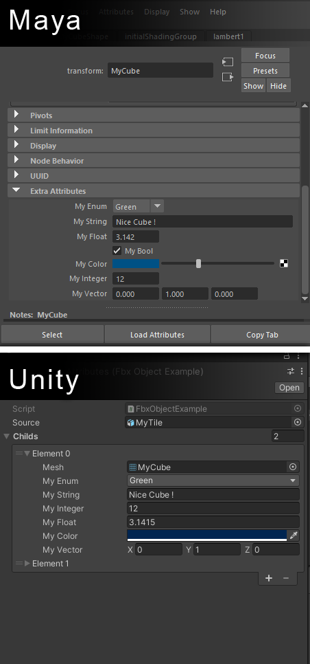

# Fbx Attributes
Small utility scripts to easily extract attributes from FBX file meshes and get them into unity.</br>
This allow you to set up a scriptable object that will automatically receive the attributes of an FBX mesh.




&nbsp;

## Application

I use this technique in a procedural generation.<br/>
*The parts of the castle are from [KattyLi's 3D model on sketchfab](https://sketchfab.com/3d-models/3-medieval-towers-8b509574fc8a442fa88ed85506bcb416)*<br/><br/>


The terrain above is procedurally generated using the tiles below.
I created these tiles in Maya and put attributes on them with information allowing the generation algorithm to place them in the right place.<br/><br/>
<br/>
<br/><br/>
The creation time is greatly optimized. After I finished my export from Maya, a simple focus on the Unity application triggers the reimport of the model, its attributes and restarts the generation of the terrain. I can then directly see the result of my modification / new part.<br/>

&nbsp;

## Usage
### ⚠️**This project requires the FBX Exporter package** 
##### *(Official Unity package available in the Unity Registry from the Package Manager tool in Unity).*
-----
The whole thing is quite simple to use. An example is available in the project.

To use the project, you have to make two scripts:

 - The first one will contain the attribute data. It must have the **[System.Serializable]** attribute and implement the **IMeshAttributes** interface. Then, put the variables you want to extract from the FBX file.

```csharp
//Simplified example on purpose - See the FbxMeshExample.cs script for more details
using UnityEngine;

[System.Serializable]
public class MyFbxMeshAttributes : IMeshAttributes
{
    //Required data 
    public Mesh mesh { get; set; }
    public string[] materials { get; set; }

    //Attributes that will be read from the fbx file
    public MyEnum myEnum;
    public string myString;
    public int myInteger;
    public float myFloat;
    public Color myColor;
    public Vector3 myVector;
}
```
&nbsp;
 - The second class is the scriptable object which will contain a list of instances of the previous class and will be automatically generated. 
It must have the attribute **FbxAttribute(string filenameFilter)** and inherit from **FbxScriptableObject\<MyFbxMeshAttributes\>**.

```csharp
[FbxAttribute("Tile", suffix = "_Attributes")]
public class MyFbxObject : FbxScriptableObject<MyFbxMeshAttributes>
{
}
```
The filenameFilter is used to indicate which objects should have a postImport on them. Only objects containing the filter will be processed. You can use regex functions.
  
The suffix is optional, it is used to add a suffix to the generated file, this can easily avoid clashes.

&emsp;
-----
&emsp;

In your second script. You can access the data with the variable **childs**.

You can also override the **OnPostImport()** function which is called after each update of the object.

```csharp
[FbxAttribute("Tile", suffix = "_Attributes")]
public class MyFbxObject : FbxScriptableObject<MyFbxMeshAttributes>
{
    public void LogAllChildsNameAndColor()
    {
        foreach (var child in childs)
        {
            Debug.Log($"Mesh {child.mesh.name} is {child.myColor}");
        }
    }

    public override void OnPostImport()
    {
        Debug.Log("This object has just been updated");
    }
}
```

&emsp;
## Maya helpers

Setting attributes on Maya is sometimes a bit painful, the interface does not allow to create all types and the setup can be long.<br/>
So I created a new shelf that you can get in<br/>
```Maya\self_Attributes```<br/>
and copy in your folder :<br/>
```C:\Users\[UserName]\Documents\maya[Version]\prefs\shelves\```

<br/>

This allows you to create attributes more quickly and copy them from one object to another.
